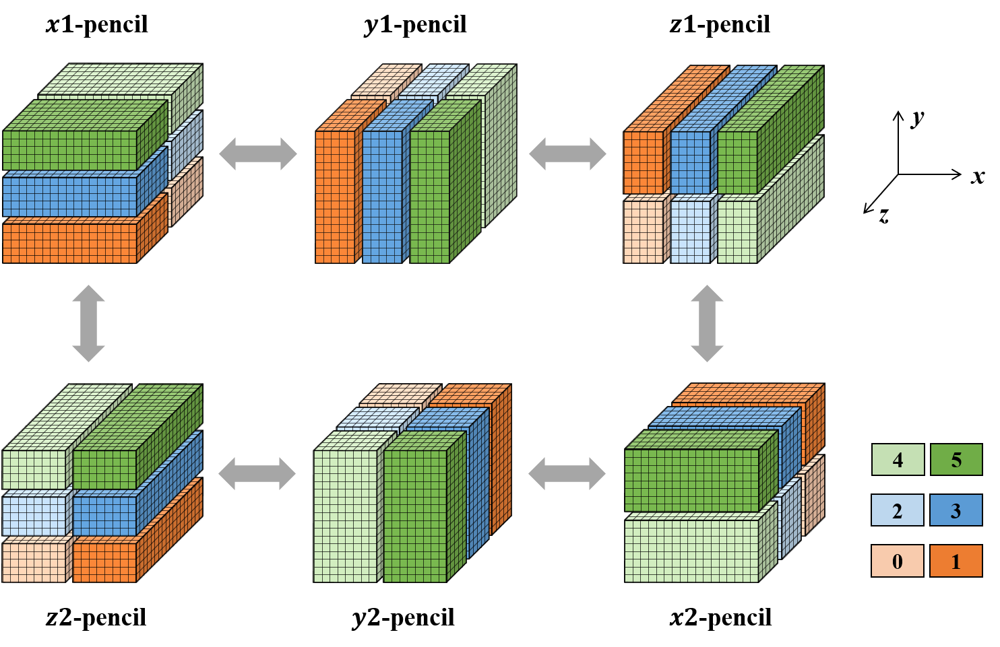
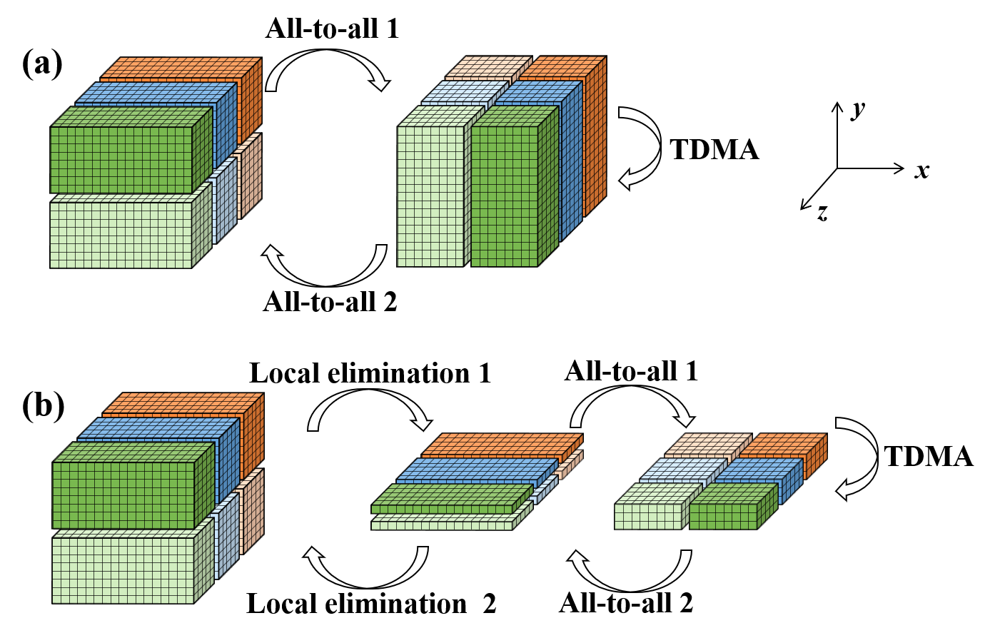
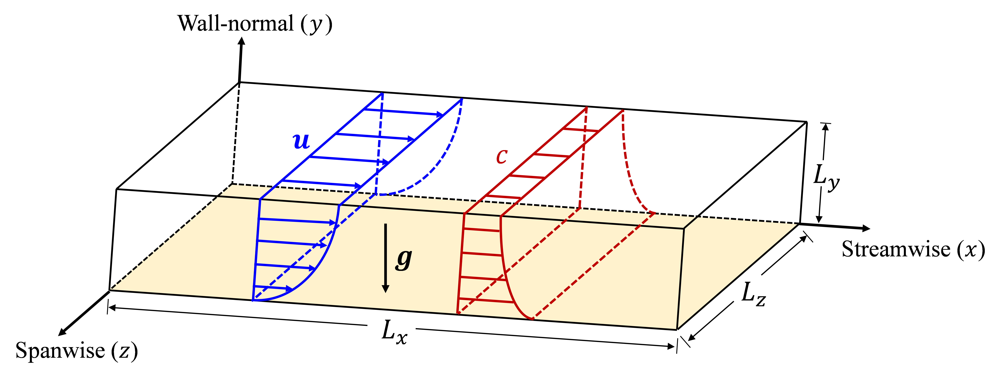
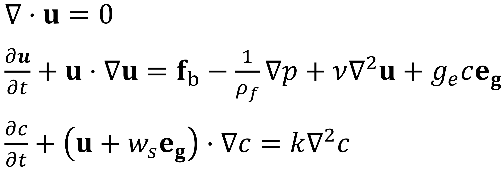
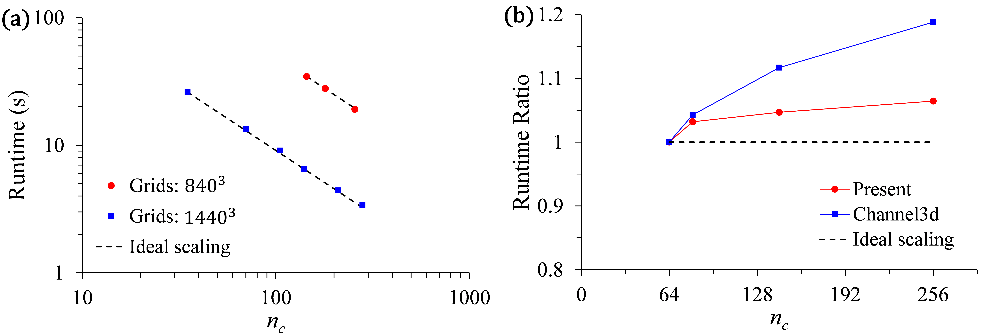

# ParaTC
&emsp;**ParaTC** is a high order finite difference solver for simulations of turbidity currents with high parallel efficiency:
* MPI parallelization by means of pencil distributed decomposition. In order to improve the parallel efficiency, we propose a new 2D pencil-like parallel configuration with totally 6 different pencil arrangements.
* A [parallel Thomas algorithm](https://github.com/MPMC-Lab/PaScaL_TDMA) is included to further reduce the communication overhead when solving tridiagonal equations.
* An optimal search method is performed in the initializing stage to find the fast Poisson solver scheme among four alternatives for specific mesh configuration. The runtime ratio between traditional pencil-like Poisson solver and present solver is about 1.5.
```
  An example of the optimal PPE method search. Corresponding grid number is 9216×140×1400.
  Auto-tuning mode for Poisson Solver......
    Choice-1, time= 4350.00035871624
    Choice-2, time= 4099.76840879989
    Choice-3, time= 3699.08386557852
    Choice-4, time= 4507.20634813479
  The best Poisson Solver choice is probably Choice-3
```
*  Periodic conditions are imposed in streamwise (x) and spanwise (z) directions.
* Navier-Stokes equations,coupled with an active passive scalar transport equation, are simulated.
* Fourth-order spatial scheme is used for periodic directions, i.e., streamwise and spanwise directions. Second-order scheme is used in wall-normal direction.
*  An approximate linear strong scaling performance is achieved, and the weak scaling performance is also improved.

## Installation :briefcase:
&emsp;As for compilation, present solver has the following two prerequisites:
* MPI
* Gfortran/Intel Fortran (Supporting Fortran 2003 or higher version)

&emsp;**FFTW-3.3.9** library has been explicitly included in the directory `./src/ThirdParty/fftw/`, so compiling and additional linking to external FFTW are avoided. (**Note: Recompiling FFTW for first use is strongly recommended.**)
&emsp;After entering the folder `ParaTC-master/` in terminal, you can compile the code as follows:
```
1. chmod a+x ./mymake.sh
2. ./mymake.sh
3. choose the correct compiler you use, and the executable you want to compile, following guidances printed in the terminal
```
&emsp;Yon can also compile the `interpolateField` code in the folder `./Tool/interpolateField/` by typing:
```
1. cd ./Tool/interpolateField
2. chmod a+x ./makeInterp.sh
3. ./makeInterp.sh
4. choose the correct compiler you use, and the executable you want to compile, following guidances printed in the terminal
5. cd ../..
```
&emsp;If the compiling process successfully, the executable file `ParaTC` will be appeared in the folder `ParaTC-master/`, and `interpolateField` will be included in the folder `./Tool/interpolateField/`.

## Usage :book:
&emsp;After compiling the code successfully, you can run the executable file like that:
```
mpirun -n [np] ./ParaTC [inputFile]
```
&emsp;Here:
* `np` denotes the number of processors you use
* `inputFile` is the name string for the input parameter file  

&emsp;For instance, if you want to run the canonical closed-channel case at Re $\tau$ = 180, you can type the following words in your terminal:
```
mpirun -n 8 ./ParaTC ./Input/TurbCha0180_4th.standard
```
### Input file
&emsp;The input file examples are stored in the folder `./Input/`. See  `./doc/ParaTC_prm.md` for detailed descriptions to the input file.
